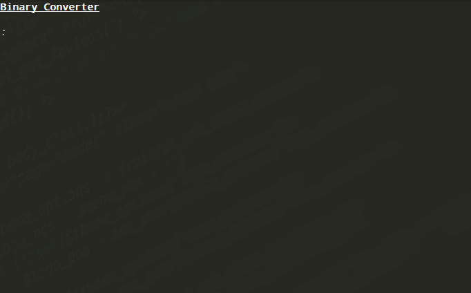

# Binary Converter
Converts binary to letters and vise versa.

## Info

Can convert small & Big letters to binary and the other way around. Only converts one letter at a time.
 
Demo:
 

 
 

## Installation
1.) Click <a href="" target="blank">This Link</a> Or clone this repo.

2.) Open the folder called 'Converter'

3.) Done!

 

## Usage

Type:
$ sh converter.sh
In a terminal in the 'Converter' Folder your downloaded, to run the program.

 

## Contact

Github: <a href="https://github.com/Buscedv" target="blank">@Buscedv</a>
Email: <a href="mailto:edvard1807@gmail.com" target="blank">edvard1807@gmail.com</a>
Instagram: <a href="https://instagram.com/Buscedv" target="blank">@Buscedv</a>

### Edvard Busck-Nielsen 2018
